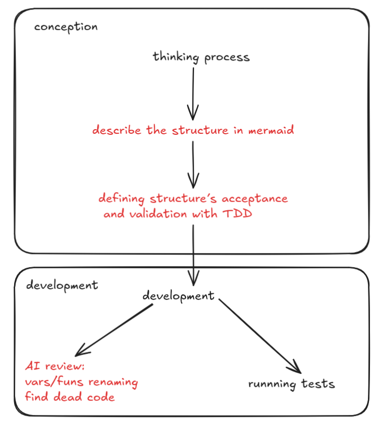
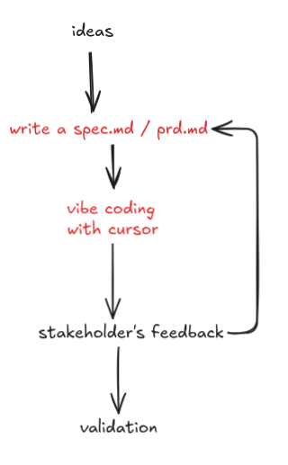

Il est temps de mettre par écrit mon retour d'expérience sur l'utilisation des LLM depuis fin 2024 jusqu'à maintenant.

Et on va commencer par ma pratique de développement. J'ai dorénavant 3 pratiques de dev :

## Sans LLM

J'utilise toujours nvim avec [kickstart](https://github.com/nvim-lua/kickstart.nvim). Ça fait des années que j'utilise (n)vim, sur ma machine et en prod. Je ne conseillerai pas à un débutant d'utiliser nvim. C'est quand même beaucoup de temps à "dompter" la conf, les plugins etc. Même si c'est plus facile qu'il y a 10 ans, je pense que ce n'est pas rentable en termes d’éfficacité à court terme.

"Vite fait, bien fait", c'est un peu ma philosophie quand je dev "à la main". Quand j'ai bien balisé ce que je dois faire, c'est la pratique la plus rapide.

Avoir un backup, un *copilot*, me donne moins la flemme de faire des trucs considérés comme chiant. Quoi qu'il arrive, j'initie les tests avec un commentaire même si je ne les implémente pas. Je me préoccupe moins sur des détails comme les noms de variables/fonctions par exemple.

Autre chose qui a changé, mermaid est devenu mon meilleur pote. Je décris mon architecture, mes idées, le flow des actions, etc... C'est un format très apprécié chez nos potes les LLM.

## Copilot

Je m'aide des LLM (avec cursor) pour coder, mais je garde le contrôle. Je l'utilise pour deux choses:

- Améliorer la qualité du code existant

Meilleur naming de fonction/variable, refactoring, trouver du code mort, debug, etc. Je délègue le travail de finition quand j'ai la flemme/fatigue/quand ça me prendrait trop de temps.

- Améliorer ma pratique du TDD

Le TDD est extrêmement important pour moi, je le vois comme la fondation de mon code. C'est écrire les règles d'acceptation, définir les critères qui valident la structure, la logique etc.


<div style="display: flex; justify-content: center;">
  
</div>

<div style="display: flex; flex-direction: column; align-items: center; text-align: center; gap: 2px;">
  <div style="color: black;">
	noir: à la main
  </div>
  <div style="color: red;">
	rouge: cursor
  </div>
</div>

J’en ai toujours fait, mais aujourd’hui j’en fais bien plus. Mon code a gagné en lisibilité et en robustesse et surtout, j’ai remarqué que je développe plus rapidement — non pas avec le code généré par Copilot, mais parce que je consacre davantage de temps à la conception. Ma structure est mieux balisée, je m’égare moins, je fais moins d’allers-retours. Ce gain vient de la préparation en amont de mon code + que le LLM en soit.

## Vibe coding

C'est l'un des termes qu'on retrouve le plus quand on parle de développement avec LLM. J'ai l'impression de voir deux sons de cloche:

- C'est surcoté, le code n'est pas très quali dans sa globalité. Ça fait grossir la dette technique. Relire et modifier du code issu du *vibe coding* est un calvaire.
- C'est le futur, tout le monde peut devenir développeur, t'as une idée, c'est développé en un instant.

Sortons de ça. J'ai deux *use case* au *vibe* :

### Prototype

J'ai une idée de nouvelle feature. Ce que je veux, c'est explorer des idées et valider. Mon besoin c'est sortir quelque chose vite, avoir des retours, continuer ce cycle jusqu'à validation. Le *vibe coding* est parfait pour ça.

<div style="display: flex; justify-content: center;">
  
</div>

<div style="display: flex; flex-direction: column; align-items: center; text-align: center; gap: 2px;">
  <div style="color: black;">
	noir: à la main
  </div>
  <div style="color: red;">
	rouge: cursor
  </div>
</div>

C'est exactement comme un brouillon d'un exam de math. Je griffonne sur une feuille mes idées, j'explore, et quand je valide (je donnais souvent mon brouillon en exam, il revenait avec des corrections) et je mets au propre. 

Si `spec.md` ou `prd.md` ne vous parlent pas, Geoffrey Huntley a écrit [You are using Cursor AI incorrectly...](https://ghuntley.com/stdlib/), l'un des meilleurs articles du début de l'année sur le développement avec LLM. Il nous raconte que pour développer sous LLM, il nous faut une *stdlib*, un *set* de prompt et de fichiers d'information qu'on doit ajouter au contexte quand on discute avec un LLM pour une meilleure utilisation.

Les fichiers que j'utilise le plus de mon *stdlib*, c'est:

- *product requirement document* (prd) et spec.md
- *white paper*
- *prototype summary*
- rules.mdc, [le format de régle de cursor](https://docs.cursor.com/en/context/rules)

Pour le prd et le spec, il y a beaucoup d'article sur le sujet. Je trouve que Geoffrey est toujours une source sur [From Design doc to code: the Groundhog AI coding assistant](https://ghuntley.com/specs/). Par contre, un retour qu'on s'est fait avec [Sven](https://www.linkedin.com/in/sven-rodriguez/), c'est que le prd et la spec deviennent très très vite obsolète et que ça devient vite un poids à mettre à jour. A chaque grosse modification, je préfère réécrire le prd et le spec.

Pour le *white paper*, c'est un fichier qui se compose d'une liste de questions et de leurs réponses. Ça peut être des questions tech, produit ou même philo. Le but de ce fichier est de garder pourquoi on a fait certain choix ET lors de session de vibe/copilot ou [juste question réponse](https://rdesousa.fr/llm-genius/) d'apporter encore plus de contexte.

```text
## Pourquoi on est passé de pg_vector à Meilisearch ?

*réponse*


## Pourquoi kubernetes n'est pas une bonne solution pour nous ?

*réponse*

```

Pour le `prototype summary`, c'est simple. À chaque fin de session de *vibe* je demande à un LLM de m'écrire ce qu'il a appris entre le code qu'il a généré et mes corrections à la main. Le but est que les sessions n+1 se rapprochent de plus en plus de la façon dont j'aurais codé.

### Démo client

Chez Cohortes, j'ai dû faire le *sales*, sacré aventure. Le but est de transformer un prospect en client. Pour ça, il faut répondre à un besoin d'un client. Ma stratégie a été la suivante

- Première réunion: présentation, j'écoute le client et son besoin et pourquoi il a accepté un call avec nous, etc.
- Je vibe une feature liée au besoin du client.
- Démo: Je présente la feature expérimentale, bingo.

Tout ça pour dire: **Je ne mettrais jamais** du code généré via *vibe coding* en prod parce que je ne peux pas appliquer les mêmes standards que pour du code en prod:

- Lisibilité
- Maintenabilité
- Documenté
- Testé

Par contre pour valider et aller vite, c'est *IMBATTABLE*.

En fait le *vibe coding* me rappele quelque chose, **les besoins doivent correspondre au cycle de vie de développement**.

## Plus de conception, et une maîtrise du cycle de vie

Dans [Why software developers (quite honestly) hate Agile](https://www.objectstyle.com/blog/why-developers-hate-agile):

> [...] programmers are asked to commit to arbitrary estimates and deadlines and never get the time to think thoroughly about the features they’re creating.

Coder avec LLM me rappele qu'on ne fait jamais assez de conception et que trop de fois le cycle de vie du code nous échappe.
