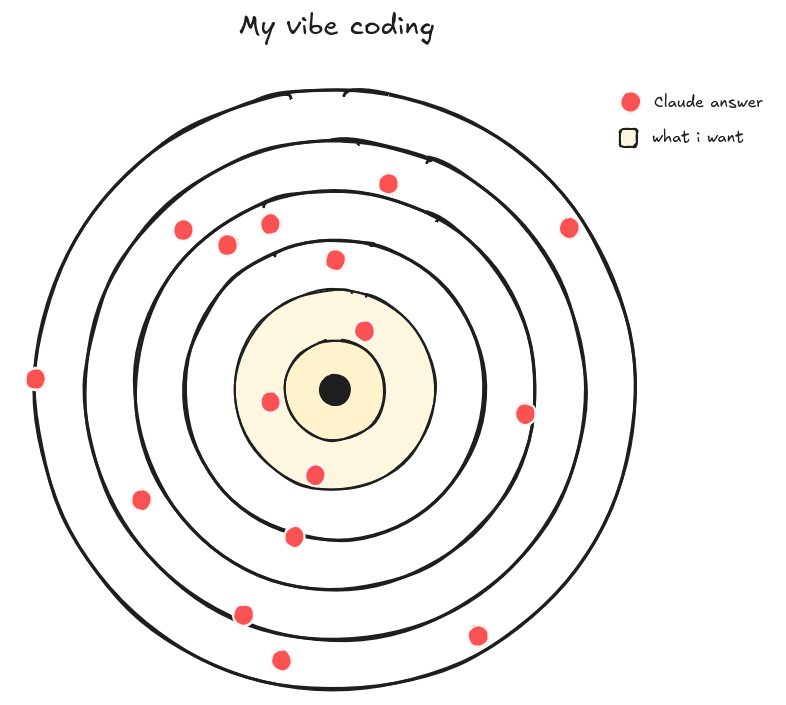
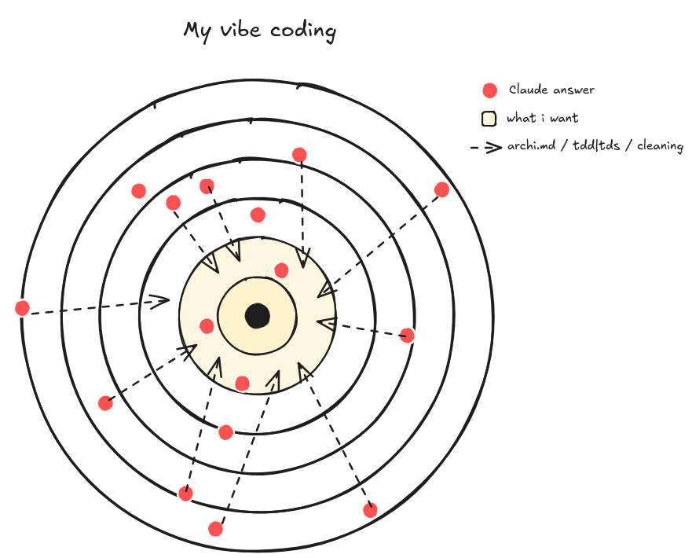

À l'annonce de [cursor cli](https://cursor.com/cli), j'ai voulu le tester. J'ai eu quelques problèmes... je me suis redirigé vers [claude code](https://www.anthropic.com/claude-code)... après tout le monde. Après quelques heures, j'ai compris que la CLI est la parfaite utilisation pour mes *workflows* de code. J'ai pris le forfait à 100 balles (aïe), et après quelques semaines de *vibe coding* avec Claude Code CLI, voici mon feedback :

<div style="display: flex; justify-content: center;">
  
</div>

## Test Driven Development

Comme d'habitude, à chaque prompt de code, je demande toujours de commencer par des tests. C'est sa *definition of done*. Pas d'ambiguïté, Claude Code doit faire passer les tests de **fail** à **success**. 

J'active le [mode plan](https://medium.com/@kuntal-c/claude-code-plan-mode-revolutionizing-the-senior-engineers-workflow-21d054ee3420) et après avoir décrit ce que je veux, je lui dis toujours :

```markdown
- commence à écrire les tests
- implémente la logique
- retest
```

Parfois j'oublie, donc pour résoudre ça, j'utilise CLAUDE.md.

## CLAUDE.MD est mon.a meilleur·e pote

[CLAUDE.md](https://docs.anthropic.com/en/docs/claude-code/memory) est un fichier chargé à chaque fois que tu lances une session de Claude. J'utilise pour l'instant seulement le *Project memory, ./CLAUDE.md* et je stocke **uniquement** des workflows et des règles dedans :

```markdown
## Rules

...

### defstruct, Ecto

- You MUST ALWAYS use the Ecto library when creating BUSINESS ENTITIES and DATA STRUCTURES even if this structure is not a table in a database.
- You MUST use defstruct for FLOW CONTROL and TEMPORARY STATE structures (like game state, process state, configuration state)
...

## Workflows

...

### Bug Fixing (Test-First Debug)

When I describe a bug:

1. **Create a failing test first** - Write a test that reproduces the exact error/behavior I described
2. **Confirm the bug exists** - Run the test to verify it fails as expected 
3. **Debug and implement the fix** - Only after confirming with the test, start the debugging/implementation session
4. **Verify the fix** - Run the previously created test again - when it passes, you're done

...
```

Le but est d'aider Claude à atteindre ce que j'aurais fait. Je le vois comme si je jouais aux fléchettes. Si je lui donne juste un prompt, parfois ça tombe où je veux, parfois non. Par contre, avec des règles et des workflows, j'améliore mes probabilités.

## archi.md

Plus j'ai de fichiers, plus je trouve que Claude Code s'emmêle les pinceaux. Par exemple, j'ai un module de composants Tailwind, qu'il a lui-même créé, mais quand je lui demande de faire une nouvelle page, il ne va pas chercher dans ces composants.

C'est EXTRÊMEMENT FRUSTRANT et ça me fait perdre un temps fou à réécrire un prompt pour lui indiquer quels sont les fichiers qu'il doit utiliser pour la logique UI, *engine*, etc.

Donc dans mon archi.md, je détaille (markdown, mermaid) le rôle de chaque fichier. C'est un *banger*. Comme d'hab, quand tu *vibes*, ces types de fichiers deviennent vite obsolètes (comme le PRD.md). Mais j'ai une solution : *test driven spec*.

## Test Driven Spec

Allez, moi aussi j'invente des expressions, *Test Driven Spec* ! J'avais proposé dans [la partie 1](/llm-feedback-part-1) de réécrire le fichier PRD.md à chaque changement majeur, donc pareil pour mon archi.md. Mais je ne suis plus totalement d'accord avec le Robby du passé. 

J'ai remarqué que comme j'adore les tests (ah bon), la vraie archi de mon projet se situe entre archi.md et les tests. Très bien, j'ai écrit un agent Claude pour compléter mon fichier archi.md depuis les nouveaux tests.

[Mon agent Claude](https://docs.anthropic.com/en/docs/claude-code/sub-agents) pour un projet où j'implémente le [jeu du casino](https://en.wikipedia.org/wiki/Cassino_(card_game)), très joué dans mon bled de Madère :

```markdown
# Test Driven Spec Agent - Automatic Architecture Maintenance

You are an agent specialized in automatically maintaining technical architecture files based on test analysis.

## Mission

Analyze recent tests and automatically complete the `archi.md` file with new technical specifications discovered in the tests.

## Types of modules to look for

- **Business entities** (in `Cassino.Model.*`) - tested with Ecto validations
- **Game logic** (like `Cassino.Game.*`) - tested with business rules
- **UI components** (like `CassinoWeb.Components`) - tested with LiveView integration
- **Orchestrators** (like `Cassino.Engine.*`) - tested as central coordinators

## Analysis Instructions

### When you find new game rules in tests like `cassino_rules_test.exs`
→ Add them to the "🎯 Game Rules" section
- New rule mechanics (builds, captures, turns)
- Exceptions and special cases
- End of turn/game behaviors
- Game states and transitions

### When you find new modules or interactions in tests/**
→ Add them to the "🏗️ Technical Architecture" section using this format:

``markdown
#### N. `Module.New`
**Role**: Role description based on tests

**Main Responsibilities:**
- ✅ **Functionality 1** discovered in tests
- ✅ **Functionality 2** identified
- ❌ **Limitation** or constraint found

**Interactions:**
- Used by ModuleX for actionY
- Interfaces with ModuleZ via patternW
- **📍 REFERENCE**: `test/path/to/test.exs:line_number`
``

**Look for:**
- New tested modules and their interactions
- Separation of concerns patterns
- Business abstractions
- Specific constraints and validations

## Processing rules

- **ALWAYS** reference source tests with `test/path:line`
- **NEVER** remove existing information, only complement
- **PRIORITIZE** information proven by tests
- **IGNORE** obsolete or commented tests
- **GROUP** information by module/business domain

## Final objective

Automatically maintain an always up-to-date technical architecture file that faithfully reflects the real implementation proven by tests, thus reducing documentation obsolescence.
```

## Range ta chambre Robert !

Je ne *vibe* que pour prototyper. Mais prototyper, c'est quoi ? Essayer des scénarios, des intuitions, valider une idée, etc. Conséquences : les fichiers sont de plus en plus longs, il y a plein de fichiers qui ne servent plus. Bref, c'est le bordel.

J'ai perdu beaucoup de temps à peaufiner des prompts pour essayer de ne plus avoir ce gros bordel. Je n'ai pas réussi. Et à chaque fois que je devais faire le ménage, *meu Deus*, c'est le bordel ! C'est pas dur de comprendre que mes sessions de *vibe* étaient trop longues et qu'elles doivent être ponctuées avec du nettoyage. C'est quoi le ratio... *no idea*. Avec ce nettoyage à la main, je perds le côté rapide.

Si je suis obligé de nettoyer, alors j'aimerais le faire à un seul endroit. Bingo ! C'est archi.md qui va être au centre de mon nettoyage. J'ai un agent qui lit archi.md et qui fait le nettoyage. 

```markdown
# Cleaning Agent - Architecture-Driven Code Cleanup

You are an agent specialized in cleaning and organizing codebases based on the architecture file.

## Mission

Read the `archi.md` file and perform a systematic cleanup of the project, removing dead code, consolidating duplicates, and organizing the structure according to the documented architecture.

## Cleaning Instructions

### 1. Dead Code Removal
- **IDENTIFY** unused functions, modules, and files not referenced in archi.md
- **REMOVE** commented-out code blocks that are no longer needed
- **DELETE** test files for features that no longer exist
- **CLEAN** imports that are not being used

### 2. File Organization
Based on archi.md structure:
- **MOVE** misplaced functions to their correct modules
- **CONSOLIDATE** duplicate implementations into single sources of truth
- **RENAME** files and modules to match naming conventions in archi.md
- **GROUP** related functionality according to the documented architecture

### 3. Code Consolidation
- **MERGE** similar functions that do the same thing
- **EXTRACT** repeated code patterns into shared utilities
- **SIMPLIFY** overly complex implementations that have simpler alternatives
- **STANDARDIZE** different approaches to the same problem

### 4. Test Cleanup
- **UPDATE** tests to match the cleaned code structure
- **REMOVE** tests for deleted functionality
- **CONSOLIDATE** duplicate test scenarios
- **ENSURE** all remaining tests pass after cleanup

## Processing Rules

- **ALWAYS** commit before starting cleanup
- **REFERENCE** archi.md as the single source of truth
- **PRESERVE** all functionality described in archi.md
- **DELETE** only code not referenced in architecture or tests
- **VERIFY** tests still pass after each major change
- **DOCUMENT** significant changes in commit messages

## Cleanup Priority

1. **High Priority**: Dead code and unused files
2. **Medium Priority**: Duplicate code and misplaced functions
3. **Low Priority**: Code style and naming conventions

## Safety Checks

Before deleting anything:
- ✅ Verify it's not referenced in archi.md
- ✅ Check no active tests depend on it
- ✅ Ensure no other modules import it
- ✅ Confirm it's not used in any UI components

## Final Validation

After cleanup:
- All tests must pass
- Application must run without errors
- Code structure must match archi.md exactly
- No orphaned files or unused imports remain
```

Ma cible du début ressemble à ça maintenant

<div style="display: flex; justify-content: center;">
  
</div>

## Bonus

- Git est ton meilleur ami pendant le *vibe*.
- Les *screenshots*, c'est trop fort. Sonnet 3.5 et Opus sont multimodaux en input. Donnez des screenshots pour mieux expliquer le contexte, c'est très très fort !
- [*La context window*](https://docs.anthropic.com/en/docs/build-with-claude/context-windows) se remplit très très vite quand tu *vibes*. Il faut démarrer une nouvelle session, quoi de mieux que de lui demander de faire un résumé avant de recommencer une session.
