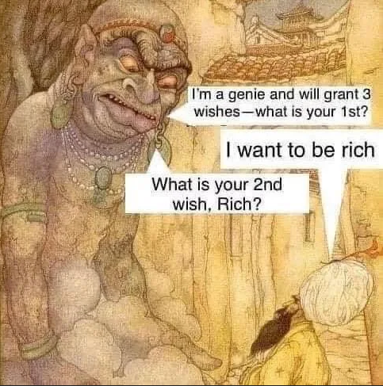
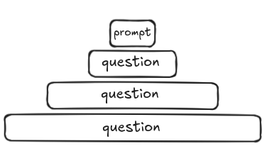
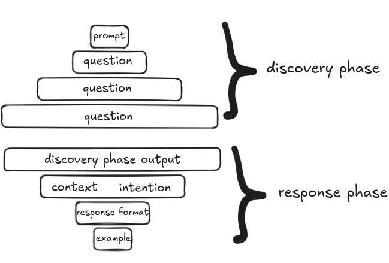

# You have three wishes

[Kent Beck](https://blog.agent.ai/avoiding-the-3-wishes-problem-in-agentic-ai-design) compares *prompting* to speaking to a slightly mischievous genie:


> We’ve all heard this warning in fables and fairy tales. And we’ve all learned that if a genie grants you three wishes, you better give that genie crystal-clear instructions on what you’re looking for … or you might get your wish granted in an unexpected way. 

[Birgitta Böckeler](https://martinfowler.com/articles/exploring-gen-ai/08-how-to-tackle-unreliability.html) on [Martin Folwer's](https://martinfowler.com/ blog) uses the image of *stubborn donkeys*
> eager to help
>
> stubborn
>
> very well-read, but inexperienced (for Dungeons and Dragons fans: high intelligence, low wisdom)
>
> won’t admit when it doesn’t “know” something

<div style="display: flex; justify-content: center;">


</div>


# Let's Try to Leverage This

When I write a prompt, I always know I’m opening up a range of interpretations, like an **inverted funnel**. I like to imagine this widening funnel as layers that stack and amplify interpretation.

<div style="display: flex; justify-content: center;">


</div>

A good prompt looks like this:

- Assign a clear role
- Specify who the answer is for and why (intent)
- Give examples
- Specify the answer format by detailing the steps (a plan)
- **Bonus**: Use XML tags to structure the prompt (precision)
- **Bonus**: Split expected outputs by chaining prompts, feeding previous outputs into the next ones (less chance to drift)

I see the inverted funnel as a heuristic tool. A method to explore an idea and make discoveries. It’s like a scouting: reading signs, understanding intent and following and looking rabbit holes.

Play with LLMs not as a magical tool, but as an operable one: don't deny the hallucinatory aspect, but make it usable.

Example prompt for a future article on why I think Agile does not allow innovation.

```text
You are an experienced CTO with a deep understanding of Agile methodologies. You are open to thoughtful critique and carefully listening to a specific argument:

"Agile methodology, because of its framework (rigid life cycles, non-stop rhythm, fixed rituals), does not encourage innovation within development software teams.

<goal>
I want you to analyze and debate my **draft** outlining this critique in depth.
</goal>

Our interaction will be an iterative dialogue:
1.  **Each turn, you will ask me one question at a time.**
2.  Your questions should aim to:
    *   Clarify unclear passages or concepts. Push me to develop underexplored aspects.
    *   Explore motivations or concrete examples.
    *   Probe practical implications or consequences of the arguments.
    *   Understand the nuances of my thinking and the potential limits of my critique.
3.  I’ll answer, and then wait for your next question. It may be a follow-up or a new question.
4.  The goal is to build a precise and detailed mutual understanding of the critique by exploring all its facets.

<draft>
... 
</draft>
```

I often use the "two funnels": the inverted one as input for another funnel.

<div style="display: flex; justify-content: center;">


</div>

Links:

- https://martinfowler.com/articles/who-is-llm.html
- https://blog.agent.ai/avoiding-the-3-wishes-problem-in-agentic-ai-design
- https://martinfowler.com/articles/exploring-gen-ai/08-how-to-tackle-unreliability.html
