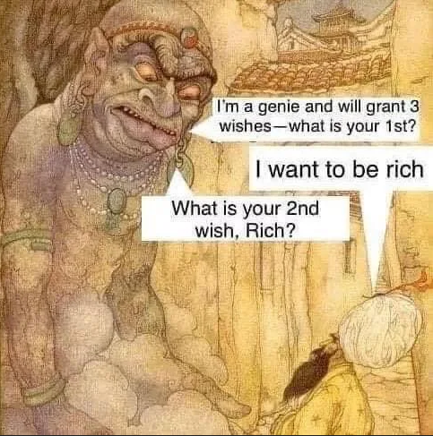
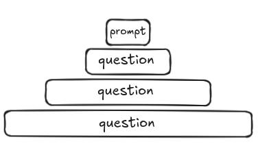

## Tu as droit à trois vœux

[Kent Beck](https://blog.agent.ai/avoiding-the-3-wishes-problem-in-agentic-ai-design) compare le *prompting* comme si on parlait à un génie un peu malicieux:

> We’ve all heard this warning in fables and fairy tales. And we’ve all learned that if a genie grants you three wishes, you better give that genie crystal-clear instructions on what you’re looking for … or you might get your wish granted in an unexpected way. 

[Birgitta Böckeler](https://martinfowler.com/articles/exploring-gen-ai/08-how-to-tackle-unreliability.html) dans le blog de [Martin Folwer](https://martinfowler.com/) utilise l'image d'un *stubborn donkeys*
> eager to help
>
> stubborn
>
> very well-read, but inexperienced (for Dungeons and Dragons fans: high intelligence, low wisdom)
>
> won’t admit when it doesn’t “know” something

<div style="display: flex; justify-content: center;">
  
</div>

## Essayons de profiter de ça

Quand je formule un prompt je sais toujours que j'ouvre un éventail d'interprétations possibles, comme un **entonnoir inversé**. Et j'aime bien imaginer l'élargissement de l'entonnoir comme des couches qui se superposent et qui permettent d'amplifier l'interprétation. 


<div style="display: flex; justify-content: center;">
  
</div>

Un bon prompt ressemble à ça:

- Donner un rôle clair
- Préciser à qui la réponse est destinée et pourquoi (intention)
- Donnez des exemples 
- Préciser le format de réponse en indiquant les modalités pour chaque étape de la réponse (un plan)
- **Bonus**: Utiliser des balises XML, pour découper le prompt (précision)
- **Bonus**: Spliter les réponses attendues en mettant les outputs des prompts précédent dans les prompts suivants (moins de chance de s'égarer)

Moi je vois l'entonnoir inversé comme un outil heuristique. Une méthode qui permet d'explorer une idée et de faire des découvertes. C'est le travail d'un pisteur. Comprendre l'intention, suivre des pistes, baliser et trouver les culs de sac.

Jouer avec les LLM non pas comme un outil magique, mais comme un outil opérable : Ne pas nier le côté hallucinatoire mais le rendre utilisable.

Exemple de prompt sur un futur article sur pourquoi je trouve que l'Agile ne permet pas ou peu l'innovation

```text
Tu es un CTO expérimenté, doté d'une compréhension approfondie des méthodologies Agile. Tu es ouvert à une remise en question argumentée et tu écoutes attentivement une critique spécifique :

"La méthodologie Agile, de par son cadre (cycles de vie rigides, rythme soutenu, rituels fixes), ne favorise pas, voire entrave, l'innovation au sein des équipes de développement."

Mon objectif est que tu analyses et débattes en profondeur sur le contenu de mon **draft** qui expose cette critique.

Notre interaction sera un dialogue itératif:
1.  **Chaque tour, tu me poseras une seule question à la fois.**
2.  Tes questions devront viser à :
    *   Éclaircir des passages ou des concepts qui te semblent flous. Me pousser à développer des aspects moins détaillés.
    *   Explorer les motivations ou les exemples concrets.
    *   Sonder les implications pratiques ou les conséquences des points soulevés.
    *   Comprendre les nuances de ma pensée et les limites éventuelles de ma critique.
3.  J'y répondrai, et j'attendrai ensuite que tu me poses une nouvelle question. Ce pourra être une question d'approfondissement sur ma dernière réponse, ou une nouvelle question.
4.  Le but est de construire une compréhension mutuelle précise et détaillée de la critique, en explorant toutes ses facettes.

<draft>
... 
</draft>
```

Souvent j'utilise les "deux entonnoirs". Inversé comme un input d'un autre entonnoir mais celui là dans le bon sens.

<div style="display: flex; justify-content: center;">
  
</div>

Liens:

- https://martinfowler.com/articles/who-is-llm.html
- https://blog.agent.ai/avoiding-the-3-wishes-problem-in-agentic-ai-design
- https://martinfowler.com/articles/exploring-gen-ai/08-how-to-tackle-unreliability.html
