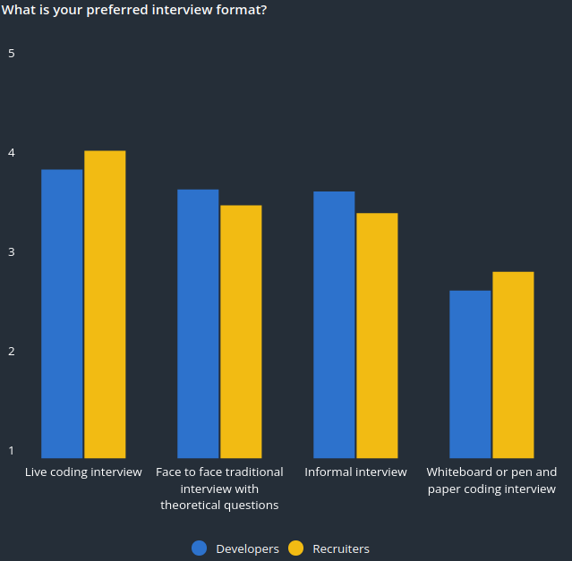

---

Le live coding est la manière pour beaucoup d'entreprise de mesurer les compétences techniques d'un candidat. Selon [codingame](https://www.codingame.com) c'est même très tendance.

  

🔗 [https://www.codingame.com/work/codingame-and-coderpad-tech-hiring-survey-2023](https://www.codingame.com/work/codingame-and-coderpad-tech-hiring-survey-2023)

## Mon dernier live coding

Début 2025, un call avec un CTO plutôt agréable, on convient d'une date d'un test technique en présentiel. Je suis reçu par le CTO, café, 5 min plus tard, on me donne un TD à faire (que j'avais trouvé sur github avant). On m'installe devant un écran, dans un open space, avec d'autres devs à côté. J'ai 1h pour le faire, je suis un peu malade, mais ça va le faire. 1h après, on relève ma copie. Je présente mon code devant 2 devs + le CTO. Avant de présenter mon code, j'apprends que ce test est le premier de l'après midi, et après, il y a un test SQL, l'impression de passer une colle de physique. Je suis un peu agacé, mais bon, il n'y a pas mille boites qui font de l'elixir en France.

Ça se passe plutôt bien, au bout de quelques échanges, on discute du fait que j'aurais pu utiliser la fonction `send_after/4` pour résoudre l'un des exos. J'explique que je ne la connais pas. J'avais perçu au moment de coder l'exercice en question qu'il me manquait l'approche idéale. **Stratégiquement**, j'ai choisi le choix de faire un *trade off*, c'est-à-dire de la dette technique. Je dois résoudre l'exercice, mais je suis contraint par le temps.

On commence à discuter des Genserver, des processus erlang et savoir pourquoi je n'ai pas utilisé `send_after/4`. Je me braque un peu, car j'ai l'impression que je suis pénalisé pour ne pas connaitre une fonction. On me pose "Qu'est-ce que c'est qu'un [DynamicSupervisor](https://hexdocs.pm/elixir/DynamicSupervisor.html)" (coup de bol j'en ai fait chez Pandascore, Sapiologie et Cohortes). Trop piqué dans mon égo, alors j'ai la bonne idée de prétendre que je ne sais pas :

> - "Je ne sais pas"
> - "OK, être un senior et ne pas savoir ça, c'est un no go pour nous. On en reste là, merci Roberto"

2 min plus tard, je suis dehors.

## Les travers du live coding

Le live coding ne reflète pas les conditions réelles des développeurs ni les conditions de développement. Quand j'écris du code, je fais des *trade off*, de la conception, cherche de l'information et discute avec mes collègues. Ça n'existe pas de me retrouver contraint à ne faire aucune de ces choses-là.

Je pense que le live coding c'est recruter un dev en évaluant des compétences techniques abstraites dans des conditions hors sol. On se base sur ça capacité à résoudre des "mots croisés version tech". C'est un poil blessant. Comment on peut prétendre évaluer sérieusement le niveau technique d'un candidat comme ça. Un recrutement, ça se chiffre en dizaine de milliers d'euros. L'implication d'un mauvais recrutement, dizaine/centaine de milliers d'euros.

**Mais surtout, comment on peut manquer autant de stratégie ?**

Dans les jeux de combat, il y a ce qu'on appelle "un piff". C'est le moment où un joueur fait une action offensive qui ne fait pas sens dans le cours de la partie. C'est le fait de ne pas respecter le plan de jeu. Alors oui le piff est aussi utilisé comme un moyen de surprendre l'adversaire, *mind game* ! Mais c'est quand même très souvent utilisé quand on ne sait pas répondre au défi présenter et/ou quand on panique.

Le live coding c'est comme un piff : il ne repose sur aucune stratégie claire et ne permet pas d'évaluer les compétences en fonction des besoins/conditions réels.

Après cette interview, je me suis vu comme un footballeur qui a raté sa présentation devant les supporters : [Top worst presentation ever in football](https://www.youtube.com/shorts/dUk_qb7dYj8?time_continue=69&embeds_referring_euri=https%3A%2F%2Fwww.google.com%2F&source_ve_path=MjM4NTE)

## Des processus plus intéressant

### System design

Exercice de construction d'une architecture ou de réponse à un problème dev à faire devant un tableau blanc, [draw.io](https://app.diagrams.net/), [excalidraw](https://excalidraw.com/).

Le processus mesure :

- la conception, la logique
- la validation des fondamentaux
- la capacité d'abstraction
- la compréhension de trade off et leur justification
- la capacité à expliquer, communiquer
- ça peut se faire en pair pour mesurer le travail d'équipe

On n'oublie pas que l'une des mesures les plus intéressantes est **la capacité à aller chercher de l'information**. Devant un énoncé, il est très (trop) intéressant d'avoir d'autres éléments pour mieux quadriller l'énoncé :

> Est-ce que je dois designer l'authentification ?
>
> Combien d'utilisateurs par jour en moyenne ?
>
> Le temps de réponse est important ou ça peut être en async ?

### Présentation d'un projet

Laisser le candidat présenter un projet qu'il a fait. On mesure :

- sa communication, présentation
- est-ce que dans sa présentation il y a des choses qui font sens avec ce qu'on fait
- la capacité à expliquer, communiquer

Accompagner d'une séance de question/réponse technique, c'est parfait. Ça marche vraiment avec les profils très expérimentés ou des experts.

### Cooptation

Retravailler avec un ancien collègue qu'on apprécie, c'est reconstituer un binôme qui fonctionne :

- Déjà validé techniquement
- Confiance renforcée

### Hackathon

Faire un hackathon ça demande un peu plus de taff, mais il y a:

- du code
- de la conception
- des échanges
- des trades-off
- des contraintes

La vie d'un projet quoi. On va chercher à renforcer des synergies, s'inspirer de nouvelles pratiques, etc.

## Le live coding comme marqueur d'un manque de stratégie

  

### L'équipe vu comme un puzzle

J'étais un joueur de MMORPG, et j'ai appris très vite que pour faire des donjons, il fallait avoir une **synergie équipe**. Avoir que des DPS est rarement une bonne tactique.

Par exemple, j'ai longtemps pensé que tout le monde devait faire des tests et documenter son code. Ce n'est pas que je ne le pense plus, mais je pense qu'il faut aussi s'appuyer sur les forces et être conscient des faiblesses . En gros, construire avant tout une équipe.

Je crois plus au [game day](https://medium.com/paris-chaos-engineering-community/un-gameday-dans-ma-team-un-besoin-de-transmettre-du-savoir-faire-42682477943e) comme outil pédagogique pour responsabiliser, préparer les situations difficiles à venir, mesure la capacité de l'équipe à développer/corriger/comprendre que d'exiger que toute l'équipe adopte certaines pratiques.

C'est pour ça que je pense que l'équipe doit participer à définir le processus de recrutement et écrire la fiche de poste. Collectivement, ils connaissent :

- les forces et les faiblesses
- les sujets a exploré
- leur méthode de travail
- les profils dont ils ont besoin

### Le processus de développement comme une vitrine de l'équipe

Je pense que le recrutement doit montrer comment la future équipe du candidat s'organise / a envie de s'organiser. Un peucomme une vitrine de librairie qui expose les derniers livres disponibles ou la dernière dédicace de prévu.

Saša Jurić dans une suite d'article dans [Towards Maintainable Elixir](https://medium.com/@sasa.juric) parle de la nécessité de construire un processus de développement. Quelles sont les méthodes de travail qu'on a envie d'avoir ?

Ce qui structure une équipe, ce sont les méthodes de travail. Publier ce processus permet de partager une culture, d'ouvrir les critères de sélection en dehors des *soft/hard skills*.

**Voici comment on bosse. Si ça t’inspire, rentre.**
